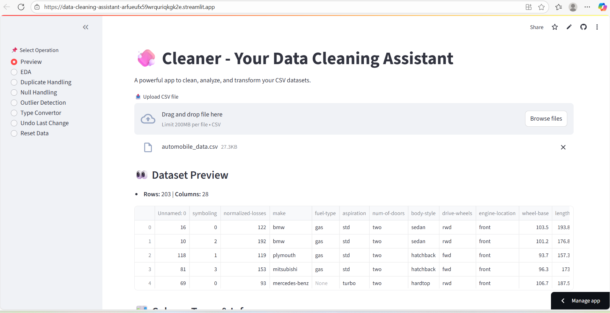

# Cleaner – Interactive Data Cleaning App

Cleaner is a no-code Streamlit app that helps you clean messy CSV datasets with ease. It supports missing value handling, outlier detection, type conversions, basic EDA, and more — all through an intuitive UI.

Live App: [Click here to try it](https://datacleanerapp-5yhhyr4tjrpffpuycj384b.streamlit.app/)  
Sample Data: `sample_data/telco.csv`

---

## ✨ Features (v1.4)

- **👀 Preview & Summary**  
  View head rows, column types, descriptive stats  
  Detailed `df.info()` and unique value counts

- **🧼 Null Handling**  
  Drop rows or columns with missing values  
  Fill numeric nulls (median or constant)  
  Fill categorical nulls (most frequent or user input)

- **🧭 Duplicate & Column Handling**  
  Detect and remove duplicate rows  
  Drop selected columns

- **📊 EDA Tools**  
  Generate histograms, box plots, bar plots, category vs. numeric plots, and correlation heatmaps

- **🚨 Outlier Handling**  
  Detect using IQR  
  Drop or cap outliers with preview of affected rows

- **🔄 Type Conversion**  
  Convert columns to int, float, string, or datetime  
  Preview conversion impact before applying

- **🛠️ Utilities**  
  Reset to original uploaded data using snapshot  
  Download cleaned dataset as CSV  
  Narrow-screen layout support (mobile/tablet friendly)


---

## Real Use Case

I used Cleaner to preprocess the [Ames Housing (Kaggle)](https://www.kaggle.com/datasets/prevek18/ames-housing-dataset):

### 1. Duplicate Check
- ✅ No exact duplicate rows found.
- Action: No cleaning required.

### 2. Null Handling

- Dropped 'Mas Vnr Type' (60.58%) 
- Dropped 'Fireplace Qu' (48.53%) 

#### Filled Categorical Columns (with most frequent value):
- 'Bsmt Qual', 'Bsmt Cond', 'Bsmt Exposure', 'BsmtFin Type 1', 'BsmtFin Type 2'
- 'Garage Type', 'Garage Finish', 'Garage Qual', 'Garage Cond', 'Electrical'

#### Filled Numerical Columns:
- 'Lot Frontage' – median
- 'Mas Vnr Area', 'Garage Yr Blt', 'BsmtFin SF 1', 'Total Bsmt SF', 'Garage Area' – median
- 'BsmtFin SF 2', 'Bsmt Unf SF', 'Garage Cars', 'Bsmt Full Bath', 'Bsmt Half Bath' – filled with 0 (sparse columns)

### 3. Outlier Handling

- Detected strong outliers in:
  - `GrLivArea`, `LotFrontage`, `TotalBsmtSF`, `SalePrice`, `GarageYrBlt`, `BsmtFin SF 2`, `Screen Porch`, `Mas Vnr Area`, `Open Porch SF`, `Misc Val`

- Action: Applied IQR-based **capping** on these variables

- Optional outliers (capped selectively):  
  - `Garage Cars`, `Kitchen AbvGr`, `Low Qual Fin SF`, `Bedroom AbvGr`, `Fireplaces`, `3Ssn Porch`

- Justification:  
  - Capping avoids row loss while reducing skew  
  - Keeps dataset stable for regression-based models
    
    
---

## Tech Stack

- Python 3.10
- Streamlit
- Pandas
- NumPy
- Seaborn, Matplotlib

---

## Screenshot



---

## Run Locally

```bash
# Clone the repo
git clone https://github.com/yourusername/cleaner.git
cd cleaner

# Install dependencies
pip install -r requirements.txt

# Run the app
streamlit run cleaner_app.py
```
---

## What I Learned
- Building stateful, dynamic UIs with Streamlit
- Managing real-time user input and validation
- Designing user-safe data operations with rollback options
- Translating repetitive data cleaning tasks into reusable tools

---

---

## 🆕 What's New in v1.4

- Undo/reset support via session-based snapshots
- Categorical preview in summary section
- Enhanced mobile/small-screen layout
- Improved UI spacing, help texts, and consistency
- Downloadable plots with clean modularized code


## License

MIT — feel free to use, fork, or extend this project.
